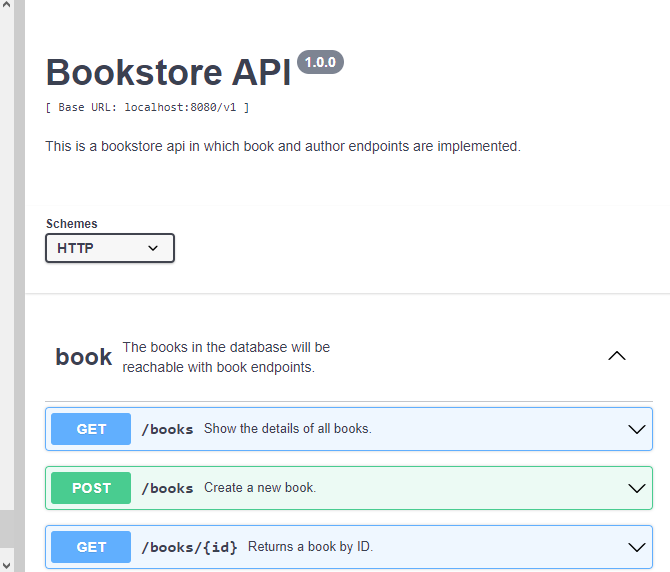
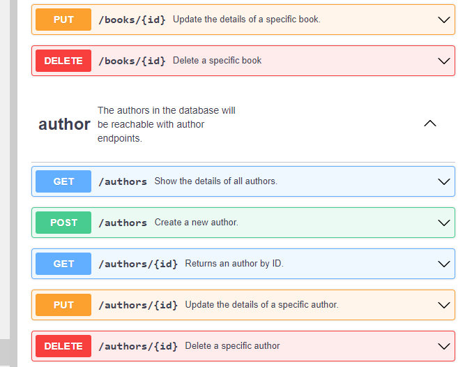
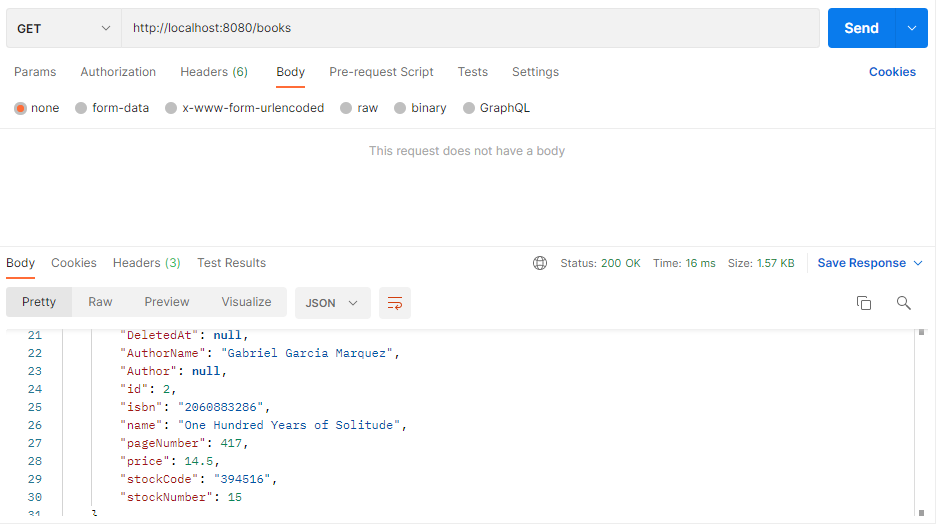
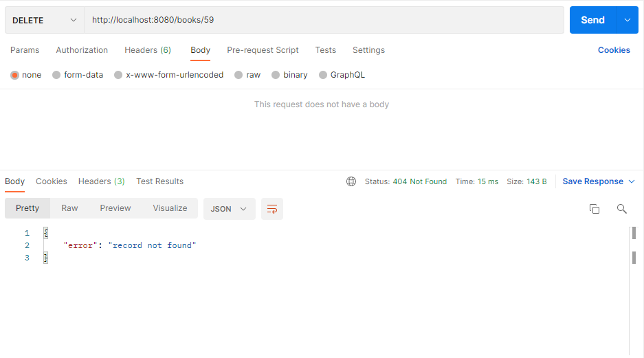

## Homework | Week 5

## Introduction

The application will be a simple REST API server that will expose endpoints to allow accessing and manipulating **books** and **authors**. The operations that our endpoint will allow include:

- **Creating** a new book,

- **Updating** an existing book,

- **Deleting** an existing book,

- **Fetching** an existing book, and

- Fetching a **list** of books.

- **Creating** a new author,

- **Updating** an existing author,

- **Deleting** an existing author,

- **Fetching** an existing author, and

- Fetching a **list** of authors.

## API Specification

In concrete terms, our application should:

* Host is  ***localhost:8080***

* Base path is ***/v1***

* To check api healthcheck informations use ***/healthcheck***
- **Create** a new book in response to a valid POST request at `/books`,

- **Update** a book in response to a valid PUT request at `/books/{id}`,

- **Delete** a book in response to a valid DELETE request at `/books/{id}`,

- **Fetch** a book in response to a valid GET request at `/books/{id}`, and

- Fetch a **list** of books in response to a valid GET request at `/books`.

- Fetch a **list** of books of an specific author in response to a valid GET request at `authors/{id}/books`.

- **Create** a new author in response to a valid POST request at `/authors`,

- **Update** a author in response to a valid PUT request at `/authors/{id}`,

- **Delete** a author in response to a valid DELETE request at `/authors/{id}`,

- **Fetch** a author in response to a valid GET request at `/authors/{id}`, and

- Fetch a **list** of authors in response to a valid GET request at `/authors`.

- **Fetch** a author of a specific book in response to a valid GET request at `/books/{id}/authors`, and

## Requirements

* Golang

* Gorilla/mux

* GORM

* PostgreSql

## Database Structure

There are 2 type of structs in this project, books and authors. They are implemented by YAML file which is created for API documentation. **YAML** file can be seen in the project folder(***book.yaml***).

## Usage

```[console]
$ go run main.go
```

## Swagger Screenshots

The api document (YAML file) is tested in Swagger 2.0 Editor. You can see the screenshots below.





## Postman Screenshot

The API is also tested with **Postman** application. The screenshots can be seen below.




## Licence

MIT
